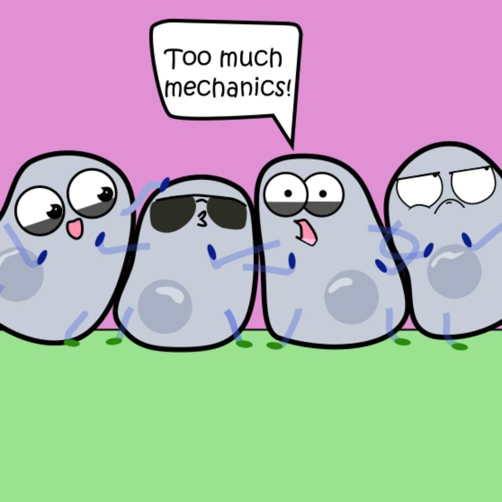

# Epithelial Mechanics Fan Club

    

We're your source for papers on various #EpithelialMechanics topics📚
Check out our accounts on [bluesky](https://bsky.app/profile/epimechfc.bsky.social) and [twitter](https://x.com/EpiMechFC).

We share one paper each working day and create mini-review threads on topics that matter to the epithelial mechanics community, gathered directly from our online community.

We provide a platform for interaction and networking for early career researchers. If you'd like to showcase your field, paper, or a topic that interests you, please feel free to contact us.

The account is managed by:
- Dr. [Nimesh Chahare](https://bsky.app/profile/onenimesa.bsky.social), Columbia University, USA
- Dr. [Julia Eckert](https://bsky.app/profile/juliaeckert.bsky.social), the University of Queensland, Australia

