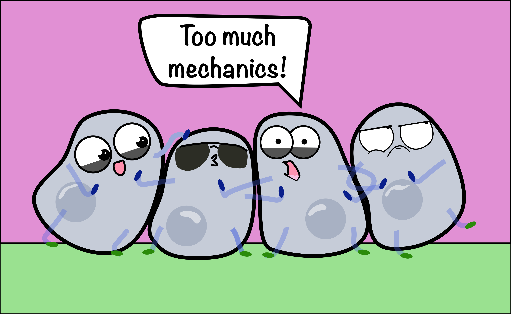

---
# Feel free to add content and custom Front Matter to this file.
# To modify the layout, see https://jekyllrb.com/docs/themes/#overriding-theme-defaults

layout: default
title: Epithelial Mechanics Fan Club
seo_title: Epithelial Mechanics Fan Club
seo_description: We're your source for papers on various Epithelial Mechanics topics

---

    

Hello!

Welcome to our Epithelial Mechanics Fan Club website! 

We provide a platform for interaction and networking for early career researchers and share, with your support, topics related to #EpithelialMechanics.   

Here's our live feed:

 <bsky-embed
    username="epimechfc.bsky.social"
    mode=""
    limit="5"
    disable-images="false"
    disable-videos="False"
    disable-autoplay="true"
    load-more="true"
>
</bsky-embed>

<!--

We're your source for papers on various #EpithelialMechanics topics📚
Check out our accounts on [bluesky](https://bsky.app/profile/epimechfc.bsky.social) and [twitter](https://x.com/EpiMechFC).

We share one paper each working day and create mini-review threads on topics that matter to the epithelial mechanics community, gathered directly from our online community.

We provide a platform for interaction and networking for early career researchers. If you'd like to showcase your field, paper, or a topic that interests you, please feel free to contact us.

The account is managed by:
- Dr. [Nimesh Chahare](https://bsky.app/profile/onenimesa.bsky.social), Columbia University, USA
- Dr. [Julia Eckert](https://julia-eckert.github.io), The University of Queensland, Australia

-->
